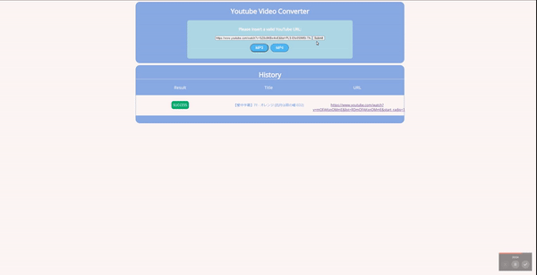
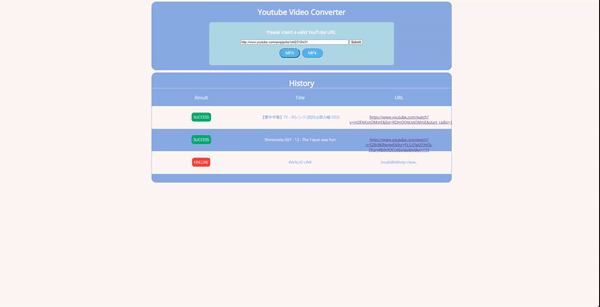

# YouTube-Video-Converter
Utilizes Flask to deploy a local webpage as a youtube-dl wrapper where users can input valid YouTube links and convert to mp3 files

# Requirements
Installation of Latest version of `youtube-dl`:
http://rg3.github.io/youtube-dl/

Installation of Latest version of `flask`:
https://flask.palletsprojects.com/en/2.0.x/

Installation of `python_settings`:
https://pypi.org/project/python-settings/

# Instructions
1) Run `src/app.py` file
2) Open a webpage at localhost http://127.0.0.1:5000/
3) Enter a valid YouTube link in the input field
4) Wait for local download and server response on the downloaded result
5) After completion check `/downloads` for mp3 file on success
6) View history of previously downloaded youtube videos for the current session and input more valid youtube links

# Demonstration

## Download

## Invalid Links and Input

# Future Updates
- MP4 format is currently unavailable
- Progress Bar (Currently only in-console progress)
- Queue

# Misc
- Previous YouTube-Video-Converter that converts youtube links and in-directory video files is in the directory `local_copy`
